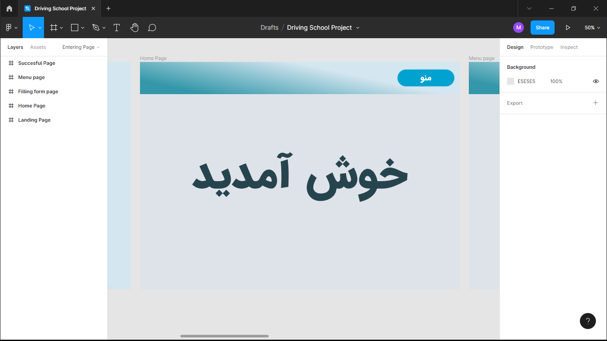

# Driving School Web Application

<div align="center">
  
  
  
  
</div>

---

**Final Grade:** 20/20

This repository contains the implementation of a web application for a driving school, developed as a Bachelor's degree project using Python, Django, and MySQL. The project includes a user-friendly interface and administrative functionalities to efficiently manage driving school operations.

---

## Table of Contents

- [Features](#features)
- [Technologies Used](#technologies-used)
- [Visual Elements](#visual-elements)
  - [EER Diagram](#eer-diagram)
  - [Design Mockups](#design-mockups)
  - [Application Screenshots](#application-screenshots)
- [Setup Instructions](#setup-instructions)
- [License](#license)

---

## Features

- **User-friendly Interface**: Intuitive UI for both admins and students.
- **Database Management**: Comprehensive database implementation using MySQL.
- **Functional Admin Panel**: Tools to manage staff, students, and classes.
- **Secure Authentication**: Login system with different roles (e.g., Manager, Trainer, Student).
- **Scalable Architecture**: Built with Django's modular framework for easy future enhancements.

---

## Technologies Used

<div align="center">
  
  
  
  
</div>

Technologies used in this project:
- **Python** for backend logic.
- **Django** for building the web framework.
- **MySQL** for database management.
- **Figma** for UI/UX design.

---

## Visual Elements

### EER Diagram


The EER diagram illustrates the database structure and the relationships between different entities such as Students, Trainers, and Classes.

---

### Design Mockups
Here are the Figma design prototypes used to create the interface:

#### Landing Page


#### Registration Form Page


---

### Application Screenshots
The following screenshots demonstrate the application in action:

#### Registering a New User (As a student)


#### Admin Panel for User Management


---

## Setup Instructions

### Prerequisites
1. **Python**: Version 3.8 or higher.
2. **MySQL**: Ensure MySQL server is installed and running.
3. **Virtual Environment**: Use `virtualenv` or `venv`.

### Installation
1. Clone the repository:
   ```bash
   git clone https://github.com/morteza80mr/driving-school-web-app.git
   cd driving-school-web-app

2. Create and activate a virtual environment:
   - On **Linux/Mac**:
     ```bash
     python -m venv myenv
     source myenv/bin/activate
     ```
   - On **Windows**:
     ```bash
     python -m venv myenv
     myenv\Scripts\activate
     ```

3. Install dependencies from the `requirements.txt` file:
   ```bash
   pip install -r requirements.txt

4. Set up the database:
   - Create a MySQL database named `driving_school_project`.
   - Update the `settings.py` file in the Django project directory with your MySQL credentials:
     ```python
     DATABASES = {
         'default': {
             'ENGINE': 'django.db.backends.mysql',
             'NAME': 'driving_school_project',
             'USER': '<your-database-username>',
             'PASSWORD': '<your-database-password>',
             'HOST': 'localhost',
             'PORT': '3306',
         }
     }
     ```

5. Apply migrations to create the necessary database tables:
   ```bash
   python manage.py makemigrations
   python manage.py migrate

6. Create a superuser account to access the Django admin panel:
   ```bash
   python manage.py createsuperuser

7. Run the development server:
   ```bash
   python manage.py runserver

8. Open your browser and navigate to:
   - Main application:
     ```plaintext
     http://127.0.0.1:8000
     ```
   - Admin panel:
     ```plaintext
     http://127.0.0.1:8000/admin
     ```

   Use the superuser credentials you created earlier to log in.

## License

This project is licensed under the [Apache License 2.0](LICENSE).
